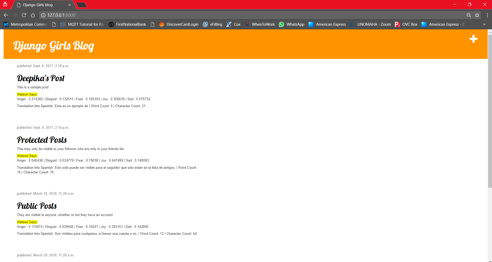
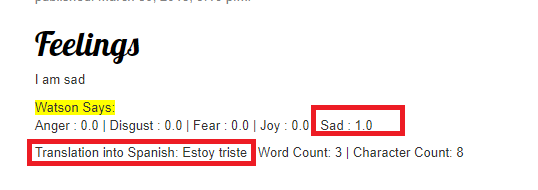

# Extension - DJANGO girls blog

This blog is built with the help of a Tutorial that gives detailed description on how to build a Python-DJANGO web application.

[Tutorial Link](https://tutorial.djangogirls.org/en/chromebook_setup/)

This code repository includes a Watson Cloud API to analyse the Tone of the Post by ToneAnalyser API and a language translator.

The [link](https://console.bluemix.net/developer/watson/dashboard) for the API's is available from [IBM Cloud](https://idaas.iam.ibm.com/idaas/mtfim/sps/authsvc?PolicyId=urn:ibm:security:authentication:asf:basicldapuser)

[Watson IBM Cloud Django Application](https://djangogirls-watson-blog.herokuapp.com)

